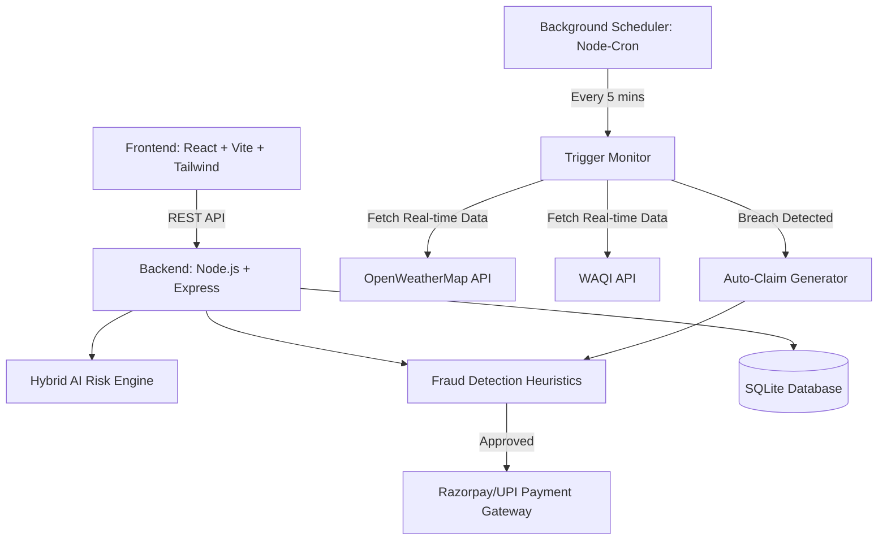

# 🛡️ ShramInsure

🌐 **Live Website:**  
https://shram-insure.vercel.app/

🎥 **Demo Video:**  
https://drive.google.com/drive/folders/1t6YedGUjufOxLaS6ZHi0KW01vtTS_8U2?usp=sharing

📊 **Pitch Deck:**  
https://drive.google.com/file/d/1lIYEsKTPnCH4a32wQvrT8cOorA90EaS7/view?usp=sharing

**AI-Powered Parametric Income Protection for India's Q-Commerce Gig Workers**

ShramInsure is a zero-touch, fully automated parametric insurance platform designed exclusively for the modern gig economy (Zepto, Blinkit, Instamart, Dunzo). When severe weather or civic disruptions block riders from earning, ShramInsure instantly detects the event and processes an automated payout—with zero paperwork, zero claims filing, and zero waiting.

---

## 🌟 The Problem
India's 15+ million gig workers are heavily dependent on daily wages. When a sudden monsoon floods the streets, or the AQI reaches hazardous levels, their income drops to zero. Traditional insurance models fail here because they are focused on health/accidents, require manual proof of loss, and take weeks to process a claim.

## 💡 The Solution
ShramInsure introduces **Income-Loss Parametric Insurance**. 
The event *is* the claim.

If independent, third-party Oracles (like OpenWeatherMap or WAQI) verify that a threshold has been breached in the worker's zone, the system automatically triggers a claim, runs an AI fraud check, and instantly initiates a UPI payout to cover the lost daily wages.

---

## 🎯 Target Persona
**Q-Commerce Delivery Partners**
We exclusively serve rapid-delivery riders (Zepto, Blinkit, Swiggy Instamart, Amazon Fresh). These riders operate in hyper-local zones (e.g., a 3km radius), making them perfect candidates for highly localized, zone-specific parametric triggers.

---

## ✨ Key Features

### 🤖 1. Hybrid AI Pricing & Risk Engine
Our deterministic AI evaluates risk and prices weekly premiums dynamically.
- **Inputs**: 30% Weather Forecast, 20% AQI Trends, 20% User Claim History, 15% Location Risk, 15% Platform Demand Factor.
- **Output**: Generates a 0.0 to 1.0 Risk Score, an AI Quote, and a predictive Next-Week Demand Forecast.

### ⚡ 2. Parametric Trigger Engine
Real-time environmental monitoring via robust third-party APIs.
- **Triggers Monitored**: Heavy Rain (>65mm/hr), Extreme Heat (>42°C), Hazardous AQI (>200), Flash Floods, and Civic Curfews.
- **Automation**: Node-cron background scheduler scans active policies every 5 minutes and auto-files claims the moment a threshold is crossed.

### 🛡️ 3. Advanced AI Fraud Detection
Instant payouts require ironclad fraud protection. Our 7-signal heuristics engine runs on every auto-claim.
- **Checks**: GPS Spoofing (Browser vs. IP vs. Platform), Time Anomalies, Weather Mismatches, and Rapid Claim Velocity.
- **Decisions**: >0.70 score = Auto-Reject. <0.40 score = Auto-Approve & Payout.

### 🌍 4. All-India Geo-Intelligence
- Built-in dataset for 21 major Indian cities.
- **Auto-Detection**: Uses HTML5 Geolocation with a backend Reverse Geocoding fallback (OpenCage API). If offline, uses a Haversine distance algorithm to assign the nearest operational hub.

### 📊 5. Enterprise-Grade Dashboards
- **Worker App**: Glassmorphism UI, real-time AI explainability banners, active policy trackers, and one-click demo simulators.
- **Admin Insights**: Real-time business KPIs, Loss Ratios, 14-day Fraud Trends, Platform Performance (e.g., Blinkit vs. Zepto), and Predictive High-Risk Zones.

---

## 🏗️ Technical Architecture

ShramInsure is built for scalability and enterprise reliability.

---

## 🎮 The "Zero-Touch" Demo Flow
Experience the platform exactly as a worker and an admin would.

1. **Onboarding**: Worker registers. The system auto-detects their location (e.g., Mumbai, Central Zone).
2. **AI Quoting**: Worker requests a policy. The AI evaluates real-time Mumbai weather and their Zepto platform profile, offering a dynamic weekly premium (e.g., ₹45/week for ₹800 coverage).
3. **The Event**: A severe monsoon hits Mumbai.
4. **The Automation**: The ShramInsure background scheduler detects the 85mm/hr rainfall via OpenWeatherMap. It finds the worker's active policy and auto-generates a claim.
5. **The Verification**: The AI Fraud engine verifies the worker's GPS pings match the Mumbai weather event. It assigns a 0.12 Fraud Score (Clean).
6. **The Payout**: The claim is approved, and Razorpay instantly credits ₹800 to the worker's UPI ID. The worker's dashboard updates with a glowing success banner.

*To test this flow yourself, check out the `SETUP.md` file for local installation instructions and use the `/simulate` page in the app!*

---

## 🚀 Future Scope
- **IoT Integration**: Connecting with smart-scooter telemetry for hyper-accurate micro-climate data.
- **Dynamic Routing Integration**: Pausing insurance premiums dynamically when the worker's Q-Commerce app goes offline.
- **Blockchain Smart Contracts**: Migrating the parametric triggers to Ethereum/Polygon smart contracts for cryptographically guaranteed, trustless payouts.
